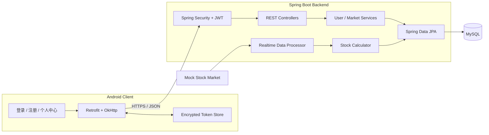

# 股票灵 Stock Monitor

一个由 Android 客户端与 Spring Boot 服务端组成的股票监控全栈原型。系统围绕移动端身份认证、行情状态维护和实时/日线数据处理构建，完整打通了客户端请求、JWT 会话、定时计算与 MySQL 持久化链路。

> 当前行情由内置市场模拟器生成，项目不连接真实证券交易接口，也不构成任何投资建议。

## 核心能力

- **移动端账户体系**：支持手机号注册、登录、退出和个人信息查询。
- **双 Token 会话**：使用 Access Token 与 Refresh Token 分离短期访问和长期会话，客户端在收到 `401` 后自动刷新并重放请求。
- **本地安全存储**：通过 `EncryptedSharedPreferences` 保存令牌，使用 AES256-SIV 加密键、AES256-GCM 加密值。
- **行情状态维护**：按交易时段轮询模拟行情，持续维护开盘价、最高价、最低价和最新价格。
- **指标计算**：实时计算涨跌幅、振幅和价格变化速度，并批量写入数据库。
- **日线聚合**：在开盘、午间休市和收盘等时间节点执行状态切换与日线数据更新。
- **配置外置化**：数据库、JWT、SSL、轮询间隔与交易时间均可通过环境变量覆盖。

## 系统架构



系统由两条主要链路组成：

1. **请求链路**：Android UI 通过 Retrofit 发起请求，OkHttp 拦截器附加 JWT；服务端完成鉴权后进入控制器和业务层。
2. **数据链路**：行情处理器按固定周期读取模拟市场数据，更新股票状态、计算指标，并通过 JPA 持久化实时数据与日线数据。

## 关键流程

### JWT 登录与自动续期

1. 用户登录成功后，后端签发短期 Access Token 和长期 Refresh Token。
2. Android 客户端将两类令牌写入加密偏好存储。
3. 普通请求由 `AuthInterceptor` 自动附加 `Authorization: Bearer <token>`。
4. Access Token 失效并返回 `401` 时，OkHttp `Authenticator` 同步请求刷新接口。
5. 刷新成功后保存新令牌并重试原请求；刷新失败则清理会话并返回登录页。

刷新逻辑使用同步互斥，避免并发请求同时触发多次 Token 刷新。

### 实时行情处理

`RealtimeDataProcessor` 使用单线程调度器按配置周期执行轮询：

- 判断当前是否处于交易时段；
- 从 `MockStockMarket` 获取股票快照；
- 使用线程安全状态表维护各股票的当日状态；
- 计算实时涨跌幅、振幅、最高/最低价和价格变化速度；
- 批量写入 `stock_realtime_data`；
- 在指定时间窗口更新开盘数据和日线数据，并在收盘后清理当日状态。

## 技术栈

| 模块 | 技术 |
| --- | --- |
| Android | Kotlin、Java、AndroidX、Material Components |
| 网络通信 | Retrofit 2、OkHttp 4、Gson |
| 客户端安全 | EncryptedSharedPreferences、JWT 自动续期 |
| 服务端 | Java 17、Spring Boot 3、Spring Web |
| 鉴权 | Spring Security、JJWT、BCrypt |
| 数据访问 | Spring Data JPA、Hibernate、MySQL 8 |
| 调度与缓存 | ScheduledExecutorService、ConcurrentHashMap、Caffeine |

## API 概览

| Method | Endpoint | 说明 | 鉴权 |
| --- | --- | --- | --- |
| `POST` | `/api/auth/register` | 注册账户 | 否 |
| `POST` | `/api/auth/login` | 登录并获取双 Token | 否 |
| `POST` | `/api/auth/refresh-token` | 刷新访问令牌 | 否 |
| `POST` | `/api/auth/logout` | 退出并更新账户状态 | 是 |
| `GET` | `/api/user/profile` | 获取当前用户信息 | 是 |

## 数据模型

后端围绕四类实体组织数据：

| Entity | 作用 |
| --- | --- |
| `User` | 用户凭据、状态与活跃时间 |
| `StockInf` | 股票代码、名称、市场类型和停牌状态 |
| `StockRealtimeData` | 时间点价格、涨跌幅、振幅、速度及日内高低价 |
| `StockDailyData` | 交易日开高低收与日级指标 |

## 项目结构

```text
stock-monitor-app/
├── android-client/                 # Android 客户端
│   └── app/src/main/
│       ├── java/.../api/           # Retrofit API 与鉴权拦截器
│       ├── java/.../model/         # 请求、响应和用户模型
│       ├── java/.../utils/         # Token 加密存储
│       └── res/                    # 页面、主题和图标资源
├── src/main/java/com/stockmonitor/
│   ├── config/                     # Spring Security 配置
│   ├── controller/                 # 认证与用户 REST API
│   ├── entity/                     # JPA 实体
│   ├── repository/                 # 数据访问层
│   ├── security/jwt/               # JWT 签发、校验与过滤器
│   └── service/                    # 用户、行情、指标与日线处理
├── src/main/resources/
│   └── application.properties      # 环境变量驱动的运行配置
└── pom.xml
```

## 本地运行

### 环境要求

- JDK 17
- Maven 3.9+
- MySQL 8.0+
- Android Studio，Android SDK 34+

### 1. 创建数据库

```sql
CREATE DATABASE stock_monitor_system
  CHARACTER SET utf8mb4
  COLLATE utf8mb4_unicode_ci;
```

### 2. 配置后端

PowerShell 示例：

```powershell
$env:DB_USERNAME = 'root'
$env:DB_PASSWORD = 'your-local-password'
$env:JWT_ACCESS_SECRET = 'replace-with-a-long-random-access-secret'
$env:JWT_REFRESH_SECRET = 'replace-with-a-different-long-random-refresh-secret'
mvn spring-boot:run
```

默认服务端口为 `8080`。生产或共享环境必须覆盖两项 JWT 密钥，不能使用仓库中的开发占位值。

常用环境变量：

| Variable | Default | 说明 |
| --- | --- | --- |
| `SERVER_PORT` | `8080` | 后端端口 |
| `DB_URL` | 本地 `stock_monitor_system` | JDBC 地址 |
| `DB_USERNAME` | `root` | 数据库用户名 |
| `DB_PASSWORD` | 空 | 数据库密码 |
| `JWT_ACCESS_SECRET` | 开发占位值 | Access Token 签名密钥 |
| `JWT_REFRESH_SECRET` | 开发占位值 | Refresh Token 签名密钥 |
| `POLLING_INTERVAL_SECONDS` | `5` | 行情轮询周期 |
| `SSL_ENABLED` | `false` | 是否启用服务端 SSL |

交易时间和日线任务也可通过 `UPDATE_PREV_OPEN_CLOSE_CRON`、`CLOSE_NOON_CRON`、`OPEN_NOON_CRON`、`UPDATE_DAILY_DATA_CRON` 调整。

### 3. 运行 Android 客户端

1. 使用 Android Studio 打开 `android-client/`。
2. 根据运行方式调整 `MyApplication.java` 中的 `BASE_URL`。
3. 使用模拟器访问宿主机时，主机地址为 `10.0.2.2`；真机调试时使用开发机的局域网地址。
4. 确保客户端协议、端口与后端 SSL 配置一致后运行 `app`。

## 协作与职责

本人主要负责客户端与服务端联调、登录注册与 JWT 刷新链路、股票数据模型以及定时行情处理；移动端页面与部分接口由团队协作完成。

## 当前状态

项目已实现认证、会话续期、模拟行情处理、指标计算和数据持久化等核心链路。行情首页、提醒策略和真实数据源接入仍处于原型阶段，后续可继续扩展：

- 接入合规的行情数据源并增加限流、重试和熔断；
- 完善自选股、K 线展示与价格提醒规则；
- 使用 WebSocket 或 SSE 推送实时更新；
- 增加 Testcontainers 集成测试与 Android UI 测试；
- 通过 Docker Compose 统一后端与 MySQL 的本地环境。

## 安全说明

仓库不包含数据库密码、JKS、证书、真实服务地址或第三方平台密钥。提交历史中使用的配置均为环境变量占位；部署时应启用 HTTPS、轮换 JWT 密钥，并使用独立的最小权限数据库账户。
